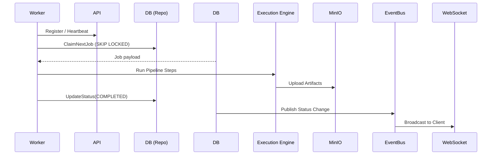

# ForgeFlow Architecture

## Overall Architecture
ForgeFlow is designed as a **Modular Monolith**. It adheres to Clean Architecture and SOLID principles, fully separating concerns between HTTP, Business Logic, and Data Access.

The system compiles into three distinct binaries deployed via Docker:
1. **API**: Serves REST requests, performs JWT auth, and routes WebSockets.
2. **Scheduler**: Daemon that evaluates job DAG dependencies and transitions eligible tasks to the `QUEUED` state.
3. **Worker**: Daemon that atomically claims jobs via `SKIP LOCKED`, executes pipeline steps, and reports logs.

## Module Responsibilities
- `internal/handlers`: Translates HTTP JSON requests to Go structs. Contains no business logic.
- `internal/services`: Enforces RBAC, verifies state machine transitions, and generates execution plans.
- `internal/repositories`: Pure GORM data access. Hides database query internals from services.
- `internal/database`: Postgres schema structs.
- `pkg/logger`: Context-aware structured logging via Uber Zap.
- `pkg/yamlparser`: GitHub Actions style pipeline definition parser.

## Sequence Diagrams

### Worker Lifecycle


## Folder Structure
```
/cmd
  /api          # REST Server
  /scheduler    # Dispatcher
  /worker       # Execution Daemon
/internal
  /database     # GORM models
  /repositories # Data access
  /services     # Business rules
  /handlers     # HTTP endpoints
  /middleware   # Auth, Logs
  /websocket    # Gorilla WS Hub
/pkg            # Shared libs (logger, config, metrics)
/web            # React Frontend
/docker         # Dockerfiles
```

## Dependency Graph
Strict downwards dependency injection:
`Handlers -> Services -> Repositories -> PostgreSQL`

*No layer may bypass the layer directly beneath it.*
